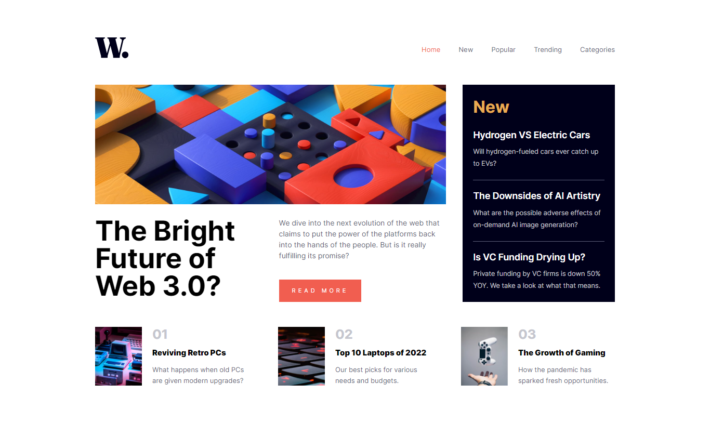

# Frontend Mentor - News homepage solution

This is a solution to the [News homepage challenge on Frontend Mentor](https://www.frontendmentor.io/challenges/news-homepage-H6SWTa1MFl). Frontend Mentor challenges help you improve your coding skills by building realistic projects.

## Table of contents

- [Overview](#overview)
  - [The challenge](#the-challenge)
  - [Screenshot](#screenshot)
  - [Links](#links)
- [My process](#my-process)
  - [Built with](#built-with)
  - [What I learned](#what-i-learned)
  - [Continued development](#continued-development)
  - [Useful resources](#useful-resources)
- [Author](#author)
- [Acknowledgments](#acknowledgments)

**Note: Delete this note and update the table of contents based on what sections you keep.**

## Overview

### The challenge

Users should be able to:

- View the optimal layout for the interface depending on their device's screen size
- See hover and focus states for all interactive elements on the page

### Screenshot



### Links

- Solution URL: [Add solution URL here](https://your-solution-url.com)
- Live Site URL: [Add live site URL here](https://your-live-site-url.com)

## My process

### Built with

- Semantic HTML5 markup
- CSS custom properties
- CSS Grid
- Mobile-first workflow

### What I learned

While working through this project I learned how to make all parts of page is responsive
with CSS Grid so I used Grid more also I learned how to create side navbar or collapse that
close to collapse that bult-in frameworks like bootstrap for example.

To see how you can add code snippets, see below:

```html
<button id="navbar-open" class="btn navbar-open p-0" data-bs-target="main-nav">
  
</button>
<div class="navbar-collapse collapse" id="main-nav">
  <button
    id="navbar-close"
    class="btn navbar-close p-0"
    data-bs-target="main-nav"
  >
    
  </button>
  <ul class="navbar-links unstyled-list">
    <li><a href="#" class="nav-link active">Home</a></li>
    <li><a href="#" class="nav-link">New</a></li>
    <li><a href="#" class="nav-link">Popular</a></li>
    <li><a href="#" class="nav-link">Trending</a></li>
    <li><a href="#" class="nav-link">Categories</a></li>
  </ul>
</div>
```

```css
/* Styling navbar collapse in small screens */
@media (max-width: 767px) {
  .navbar .navbar-toggler {
    display: block;
  }

  .navbar .collapse:not(.show) {
    width: 0;
    overflow: hidden;
  }

  .navbar .navbar-collapse {
    position: fixed;
    width: 100%;
    height: 100%;
    background-color: #0005;
    right: 0;
    top: 0;
    transition: all 0.3s ease;
  }

  .navbar :is(.navbar-open, .navbar-close) {
    cursor: pointer;
  }

  .navbar .navbar-collapse .navbar-close {
    position: absolute;
    top: 30px;
    right: 20px;
  }
}

/* Start Grid Layout */
main .grid-layout {
  width: 100%;
  display: grid;
  grid-template-areas: "best-article best-article new-articles" "latest-articles latest-articles latest-articles";
  gap: 3em 2em;
}

@media (max-width: 767px) {
  main .grid-layout {
    width: 100%;
    grid-template-areas: "best-article" "new-articles" "latest-articles";
  }
}

@media (min-width: 768px) and (max-width: 991px) {
  main .grid-layout {
    width: 100%;
    grid-template-areas: "best-article" "new-articles" "latest-articles";
  }
}

@media (min-width: 992px) and (max-width: 1199px) {
  main .grid-layout {
    column-gap: 1em;
  }
}
/* End Grid Layout */
```

```js
/*
  The following functions are handlers for click evnet of open and close buttons
  that open and close navbar collapse 
*/
function openCollapse() {
  document.getElementById(this.dataset["bsTarget"]).classList.add("show");
}
function closeCollapse() {
  document.getElementById(this.dataset["bsTarget"]).classList.remove("show");
}
```

### Continued development

In future projects I will focus on ARIA (Accessibilty Rich Internet Application), collapse code, Styling with CSS Grid,
Convert some style to components.

## Author

- Frontend Mentor - [@Ashraf-Hessen](https://www.frontendmentor.io/profile/Ashraf-Hessen)
- Twitter - [@RadientAxis](https://www.twitter.com/RadientAxis)

**Note: Delete this note and add/remove/edit lines above based on what links you'd like to share.**

## Acknowledgments

This is where you can give a hat tip to anyone who helped you out on this project. Perhaps you worked in a team or got some inspiration from someone else's solution. This is the perfect place to give them some credit.

**Note: Delete this note and edit this section's content as necessary. If you completed this challenge by yourself, feel free to delete this section entirely.**
